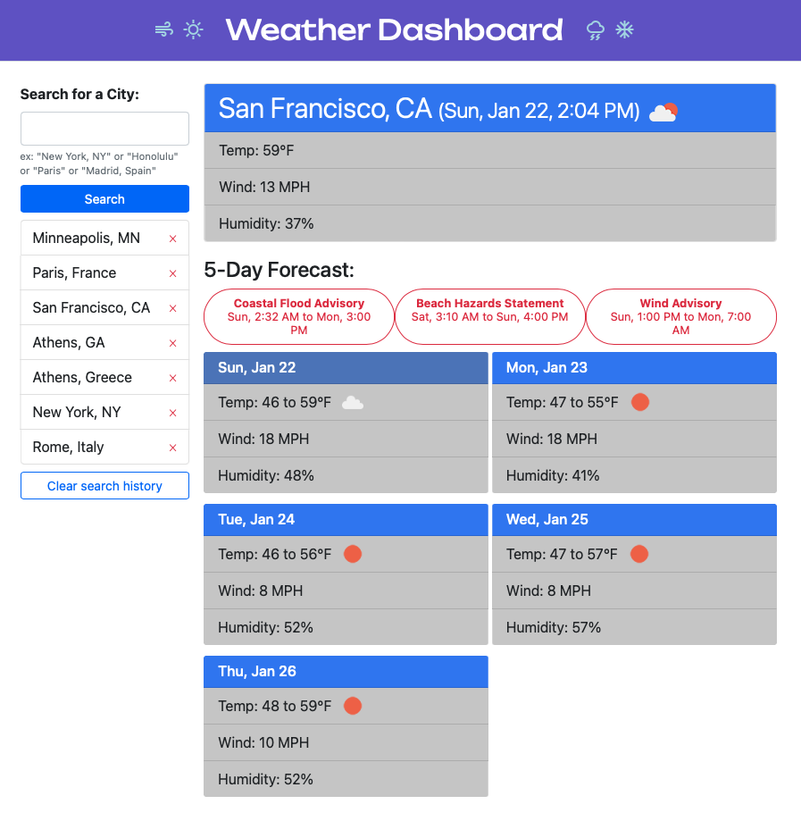

# Weather Dashboard

## Description

This is a web app that allows a user to get the current and projected weather from cities of their choosing. Each search is saved for quick access for the user, and those saved searches can be individually or as a whole cleared from the list.

You an access the application at [this location](https://lkalliance.github.io/Weather-Dashboard/).

## Usage

On the page's initial load, the user is offered a "Search for a City" input field and a search button. Any previously performed (and not cleared) searches are also listed. The user can either search for a city or can click any of their past searches to get that city's information.

City searches can be formulated from just the city name, or a city and state (either spelled out or two-letter abbreviation), or a city and country. Entering just the city with no modifier will yield the most likely city of that name. "Rome", for example, will call up Rome, Italy and not Rome, NY. But a specific search for "Rome, NY" will pull up that specific Rome.

No data will appear for a search that returns no results.

Any search the user does is automatically saved to the search history. The user can click the red "x" next to any past search to erase it from the list, or click teh "Clear search history" button at the bottom of the list to erase them all.

A successful search yields up the city's current weather conditions, including current temperature, wind speed and humidity. The header includes the city's name, the current date and its local time. It will also yield up a forecast for the next five days. Each will show the expected temperature range, high wind speed and high humidity.

The conditions (both current and for each day of the five-day forecast) are visually indicated in two ways. There is an icon that indicates conditions, and the header of each section is color-coded:

* Sunny or mostly sunny is bright blue
* Partly sunny is slate blue
* Overcast or mostly overcast is gray
* Snow is white

In addition, for current conditions, if it is nighttime the header will be very dark navy.

If there are any weather alerts, each is rendered in red above the five-day forecast, with a title and the date and time range that it is in effect for.

## Installation

There are no installations necessary for this page to operate. It currently uses just HTML, CSS and Javascript; technologies that are built into any web browser. The browser DOES need to have Javascript enabled.

## Notes on Design

The design is responsive. On very small screens, the search and search history are rendered above the results; on wider screens the search and search history are rendered to the left and the results to the right.

How to interpret a search attempt involves a trade-offs. I decided that in the absence of the user adding a state or country, I would show the first result that comes back. My testing example was Athens: just "Athens" returns Athens, Greece, while "Athens, Georgia" or "Athens, GA" or even "Athens, US" returns Athens, Georgia.

The weather icons are ones suggested (and provided by) OpenWeatherMaps.org. The color-coding of title bars involved some decision-making: there are many codes that indicate weather conditions. I decided to use 25% or less cloud cover to be "sunny", 50% cloud cover to be "partly sunny", and anything else to be "overcast". "Snow" is tied to there being a certain amount of snow. "Overcast", in this sense, is essentially the default.

At the last moment it seemed to me that the placeholder "city" text that is in the current weather header on load had the appearance of a highly-styled search field; I combated that by placing a click listener on the header that puts focus on the actual search field.

## Future additions

Some future additions may include:

* More displayed data
* Clickable alerts to show the complete text of the alert
* Setting default city to show on load
* °F/°C toggle
* Explicit ask to save searches rather than automatic saves
* More robust feedback on failed searches

## Credits

The code was all authored by me, with occasional guidance from outstanding authors and commenters from around the web, most specifically at [W3Schools](https://w3schools.com/), [MDN](https://developer.mozilla.org/en-US/) and [Stack Overflow](https://stackoverflow.com).

This site was built using the [jQuery Javascript library](https://jquery.com), the [Day.js javascript library](https://day.js.org), the [Bootstrap dev framework](https://getbootstrap.com) and [Google Fonts](https://fonts.google.com).

The data for the site is from [OpenWeatherMaps.org](https://openweathermap.org)'s public API.

## License
This web application is covered by the MIT license.